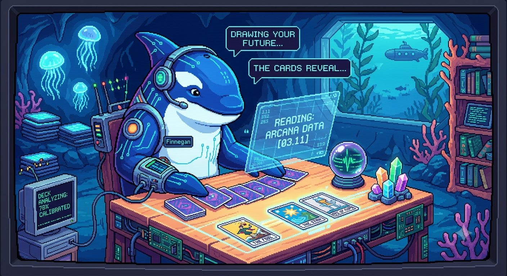

# The Major ArcanAI



A 40-card sarcastic skeleton tarot deck — twelve real major arcana (The Lovers,
Death, The Tower…) anchoring the cards life actually deals you (*The Two of
Deez, The Breast Pump, The Zoom Meeting, The Last Flying Fuck*). Ornate
black-and-white line art with Cinzel lettering, plus a gold-foil-on-black
edition.

## 🔮 Draw a card

**[musavahmed.github.io/major-arcanai](https://musavahmed.github.io/major-arcanai/)**

One-card nudge, three-card Past · Present · Future, or the five-card Full
Disaster. On a phone you get a swipeable card stack with haptics, and the
gold-foil edition catches light as you tilt — the glint and the card fan both
follow your gyroscope.

## What's here

| Path | Contents |
|---|---|
| `release/major-arcanai/` | The digital release: draw page (`index.html`), classic + foil card sets in two sizes, `deck.json`, `GUIDEBOOK.md` |
| `cards/` | Production pipeline: lettered source art, card manifest, and the build scripts |
| `.github/workflows/pages.yml` | Deploys the release folder to GitHub Pages on every push to `main` |

## Pipeline

Source art was generated with Google Gemini from per-card art direction
(scenes live in `cards/manifest.json`), then processed entirely with Python +
Pillow — no other dependencies:

```
cards/letter.py           # composite Roman numeral cartouche + name banner (Cinzel)
cards/package.py          # normalize to uniform 800×1280 art box, build deck.json + guidebook
cards/foil.py             # gold-foil edition: luster-band LUT on black stock
cards/build_draw_page.py  # generate the interactive draw page
```

## Credits

Deck concept, card names, and meanings by Musa V. Ahmed. Card art generated
with Google Gemini and art-directed by hand; lettered in
[Cinzel](https://fonts.google.com/specimen/Cinzel) (SIL Open Font License).
Built with [Claude Code](https://claude.com/claude-code).
